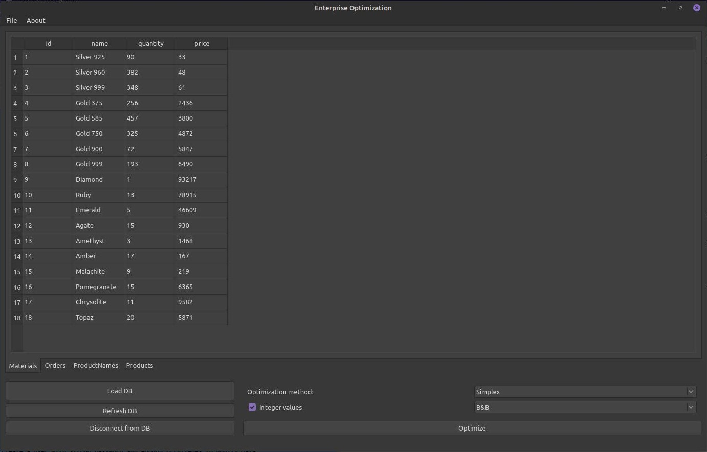

# Enterprise optimization

This repository contains graduate qualification work for bachelor degree in the speciality *Informatics and Computing Technics* in [ETU](https://etu.ru/).

## Abstract

Finding a optimal solution for production is an important task. This is why the program **Enterprise Optimization** was developed.

Basically, this program uses convex optimization solving algorithms to obtain the main goal, which is finding hte optimal solution for specified criterea:

> Let certain Enterprise have a list of **materials**, **products** and **orders**. The result needed is to obtain the amount of each product to make with **maximized materials usage** and **not to exceed the number of products by given orders**.

## Mathematical standpoint

Consider having a convex optimization problem consisting of several equations in condition form:

$$\begin{matrix}
& Ax \leq b \\
& x \geq 0 \\
& F(x) \rightarrow min
\end{matrix}$$

where $F(x)$ usually is equal to $(-\sum_ix_i)$.

There are a few algorithms to go with, e.g.:
+ LSM-based algorithm with barriers
+ Stochastic gradient descend with barriers
+ Simplex method
+ Interior point methods

## Program overview

This program is written on *C++* with *Qt 5.15 Framework* (consists of Linux default repository packages of APT such as libqt5*). Program is considered open-source software with non-commercial use.

Program uses database connection to obtain values. Implemented DBMS supports are:
+ MySQL / MariaDB
+ PostreSQL
+ SQLite
+ ODBC-compliant databases (for example, MS SQL)

Database should have three stored procedures implemented:
+ `GenerateEntries()` - creates or rewrites temporary table `Entries` with values of matrix $A$;
+ `GenerateRestrictions()` - creates or rewrites temporary table `Restrictions` with values of vector $b$;
+ `GenerateCostFunction()` - creates or rewrites temporary table `CostFunction` with coefficients of cost function $F(x)$.

Generated tables represent matrices. This should be normal because usually matrices in all used methods are sparse, so tables store list of index-value tuples. Obvious enough, not existing values are zeros by default. Tables should look like presented below.

### Entries table
|RowIndex|ColumnIndex|Coefficient|
|---|---|---|
|1|1|5|
|1|6|0.8|
|2|3|4|
|...|...|...|

### Restrictons table
|RowIndex|Coefficient|
|---|---|
|1|1|
|2|0|
|3|4|
|...|...|

### Restrictons table
|ColumnIndex|Coefficient|
|---|---|
|1|-1|
|2|-1|
|3|-1|
|...|...|

*Important note*: do not forget to create a user with strong password and enough privileges to modify data.

Also, program has a slight support of localization with russian language as an example.
